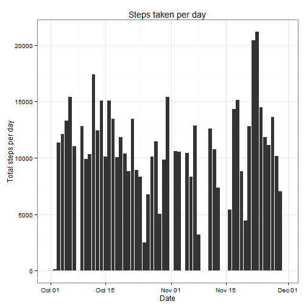
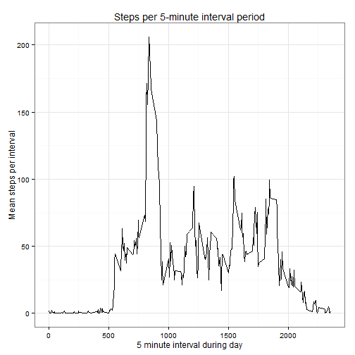
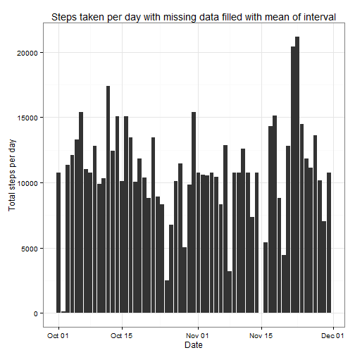
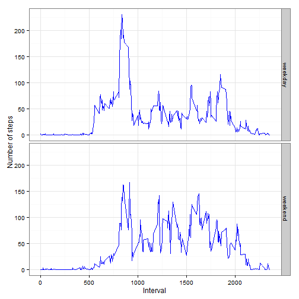

## Loading and preprocessing the data


```r
activity <- read.csv(unz("activity.zip","activity.csv"), stringsAsFactors = FALSE, colClasses = c("integer","Date","integer"))
```

## What is mean total number of steps taken per day?

```r
library(dplyr)
library(ggplot2)
stepsperday <- activity %>% group_by(date) %>% summarise(sum=sum(steps,na.rm=TRUE))
meansteps <- mean(stepsperday$sum, na.rm=TRUE) %>% round(0)
mediansteps <- median(stepsperday$sum, na.rm=TRUE)

# plot histogram of steps per day
ggplot(stepsperday, aes(x=date, y=sum)) + 
    geom_bar(stat="identity") +
    labs(x="Date", y="Total steps per day",title="Steps taken per day") +
    theme_bw()
```

 

Mean number of steps per day was : 9354

Median steps per day was : 10395


## What is the average daily activity pattern?

```r
fiveminute <- activity %>% group_by(interval) %>% summarise(intervalmean = mean(steps, na.rm=TRUE))
maxinterval <- fiveminute %>% filter(intervalmean == max(intervalmean))

ggplot(fiveminute, aes(x=interval, y=intervalmean)) +
    geom_line() +
    labs(x="5 minute interval during day", y="Mean steps per interval", title="Steps per 5-minute interval period") +
    theme_bw()
```

 

Interval with most number of steps was : 835 with 206.17 steps 


## Imputing missing values

```r
# use mean of interval for missing values
missingrows <- sum(!complete.cases(activity))

imputedactivity <- activity %>% group_by(interval) %>% mutate(steps = ifelse(is.na(steps),mean(steps, na.rm=TRUE),steps))
newstepsperday <- imputedactivity %>% group_by(date) %>% summarise(sum=sum(steps,na.rm=TRUE))
newmeansteps <- mean(newstepsperday$sum) %>% round(0)
newmediansteps <- median(newstepsperday$sum) %>% round(0)
```
The number of rows with missing steps counts is: 2304 out of a total of 17568 rows of data.

The missing data on the number of steps was filled in using the mean steps for that interval across the date range.


```r
# plot histogram of steps per day
ggplot(newstepsperday, aes(x=date, y=sum)) + 
    geom_bar(stat="identity") +
    labs(x="Date", y="Total steps per day",title="Steps taken per day with missing data filled with mean of interval") +
    theme_bw()
```

 
Mean number of steps per day with missing values replaced was : 1.0766 &times; 10<sup>4</sup> which is greater than the original data of 9354

Median steps per day with missing values replaced was : 1.0766 &times; 10<sup>4</sup> which again is greater than the original data of 10395

It makes sense that there is an increase in the daily mean and median steps, as we added steps to replace missing values, so the total number of steps per day would increase.


## Are there differences in activity patterns between weekdays and weekends?

```r
weekend <- c("Saturday", "Sunday")
imputedactivity <- imputedactivity %>% mutate(daytype = as.factor(ifelse(weekdays(date) %in% weekend,"weekend","weekday")))
plotdata <- imputedactivity %>% group_by(daytype,interval) %>% summarise(stepcount = mean(steps))

ggplot(plotdata, aes(x=interval,y=stepcount)) +
    geom_line(colour="blue") +
    facet_grid(daytype ~ .) + 
    labs(x="Interval", y="Number of steps") +
    theme_bw()
```

 
